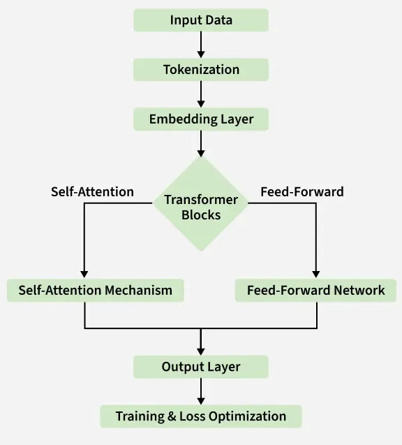

# AI/ML

## Embeddings

### What are Embeddings?

Embeddings are numerical representations of objects (words, sentences, images, etc.) in high-dimensional vector spaces. They transform discrete, categorical data into continuous, dense vectors that capture semantic meaning and relationships between objects. The key insight is that objects with similar meanings or properties should have similar vector representations, allowing mathematical operations to be performed on semantic content.

### How Do Embeddings Work?

Embeddings work by mapping discrete objects to points in a continuous vector space through learned transformations:

**Mapping Process:**
- Each object is assigned a unique vector of real numbers (typically 50-4096 dimensions)
- Similar objects are positioned close to each other in the vector space
- Dissimilar objects are positioned far apart
- The distance between vectors reflects semantic similarity

**Mathematical Foundation:**
- Embeddings use distance metrics (cosine similarity, Euclidean distance) to measure relationships
- Vector arithmetic can capture semantic relationships (e.g., king - man + woman ≈ queen)
- Dimensionality reduction techniques can visualize high-dimensional embeddings in 2D/3D space

**Context Sensitivity:**
- Traditional embeddings assign fixed vectors to objects
- Contextual embeddings (from transformers) generate dynamic vectors based on surrounding context
- The same word can have different embeddings depending on its usage

### Properties of Embeddings

**Semantic Similarity:**
- Objects with similar meanings cluster together in the vector space
- Similarity can be measured using mathematical distance functions
- Enables semantic search and content recommendation

**Compositionality:**
- Vector operations can capture semantic relationships
- Addition and subtraction of vectors can express analogies and transformations
- Enables reasoning about relationships between concepts

**Dimensionality:**
- Higher dimensions can capture more nuanced relationships
- Common dimensions range from 50 (simple tasks) to 4096+ (complex models)
- Trade-off between expressiveness and computational efficiency

**Density:**
- Dense vectors use most dimensions meaningfully (vs sparse one-hot encodings)
- More efficient storage and computation compared to sparse representations
- Better generalization to unseen data

**Transferability:**
- Pre-trained embeddings can be used across different tasks and domains
- Enable transfer learning and few-shot learning scenarios
- Reduce computational requirements for downstream applications

### How Are Embeddings Trained?

**Traditional Word Embeddings:**
- **Skip-gram/CBOW (Word2Vec):** Predict context words from target word or vice versa
- **GloVe:** Global matrix factorization combining local context window methods with global co-occurrence statistics
- **FastText:** Extends Word2Vec by considering subword information and character n-grams

**Neural Language Model Embeddings:**
- Trained as part of larger neural networks (RNNs, LSTMs) on language modeling tasks
- Embeddings emerge as internal representations in hidden layers
- Optimized through backpropagation to minimize prediction loss

**Transformer-based Embeddings:**
- **BERT:** Bidirectional training using masked language modeling and next sentence prediction
- **GPT series:** Autoregressive training predicting next tokens in sequences
- **T5:** Text-to-text unified framework training on diverse NLP tasks

**Multimodal Embeddings:**
- **CLIP:** Contrastive learning between image and text pairs
- **DALLE:** Joint training on image generation and text understanding
- Learns shared representation spaces across different modalities

**Training Objectives:**
- **Contrastive Learning:** Maximize similarity between positive pairs, minimize for negative pairs
- **Reconstruction Loss:** Minimize difference between original and reconstructed objects
- **Classification Loss:** Optimize embeddings for downstream classification tasks
- **Triplet Loss:** Ensure anchor-positive distance < anchor-negative distance

**Training Challenges:**
- **Data Quality:** Requires large, diverse, high-quality datasets
- **Computational Cost:** Training large embedding models requires significant resources
- **Evaluation:** Difficult to directly evaluate embedding quality without downstream tasks
- **Bias:** Embeddings can inherit and amplify biases present in training data


## Transformers

### What are Transformers?

Transformers are a type of neural network architecture designed to process sequential data, such as text, audio, or time-series data. They are the foundation of many state-of-the-art models in natural language processing (NLP), computer vision, and other AI fields. Introduced in the 2017 paper *"Attention is All You Need"*, transformers revolutionized AI by replacing traditional sequential models (e.g., RNNs, LSTMs) with a parallelizable architecture based on the **attention mechanism**.

Transformers are highly flexible and scalable, making them the building blocks of modern AI systems like BERT, GPT, and T5. They excel at capturing long-range dependencies and contextual relationships in data, enabling them to understand and generate complex patterns.

### How Do Transformers Work?

Transformers process input data (e.g., text or images) by encoding it into a sequence of vectors and transforming these vectors through multiple layers. The key components of a transformer are:

#### 1. **Self-Attention Mechanism**
The self-attention mechanism is the core innovation of transformers. It allows the model to focus on different parts of the input sequence when processing each token. For example, in a sentence, the model can determine which words are most relevant to the current word being processed.

- **Query, Key, and Value (Q, K, V):** Each input token is transformed into three vectors: a query, a key, and a value. The attention mechanism computes the relevance of one token to another by comparing their queries and keys, and then uses this relevance to weight the values.

- **Multi-Head Attention:** Multiple attention heads operate in parallel, allowing the model to capture different types of relationships (e.g., syntactic, semantic) within the data.

#### 2. **Positional Encoding**
Since transformers process sequences in parallel (rather than step-by-step), they need a way to encode the order of the input tokens. Positional encodings are added to the input embeddings to provide information about the position of each token in the sequence.

#### 3. **Feed-Forward Layers**
After the attention mechanism, each token is passed through a feed-forward neural network. This step processes each token independently, adding non-linear transformations to enhance the model's capacity.

#### 4. **Residual Connections and Normalization**
Residual connections and layer normalization are used to stabilize training and improve gradient flow. These techniques allow transformers to scale to very deep architectures without performance degradation.

#### 5. **Stacked Layers**
Transformers consist of multiple layers of attention and feed-forward networks. Each layer refines the representation of the input, enabling the model to capture increasingly complex patterns.

---

### Properties of Transformers

#### **Parallelization**
Transformers process entire sequences simultaneously, unlike RNNs or LSTMs, which process data sequentially. This parallelization enables faster training and inference, especially on modern hardware like GPUs and TPUs.

#### **Long-Range Dependencies**
The self-attention mechanism allows transformers to capture relationships between distant tokens in a sequence. This makes them particularly effective for tasks where context from the entire input is important.

#### **Scalability**
Transformers scale well with data and model size. Increasing the number of layers, attention heads, or parameters generally improves performance, as seen in models like GPT-3 and GPT-4.

#### **Contextual Representations**
Transformers generate dynamic, context-dependent embeddings. The same word or token can have different representations depending on its surrounding context, enabling nuanced understanding of language.

#### **Bidirectionality**
In encoder-based transformers (e.g., BERT), the model processes input bidirectionally, considering both past and future context simultaneously. This is particularly useful for understanding tasks like classification or question answering.

#### **Transfer Learning**
Transformers are pre-trained on massive datasets and fine-tuned for specific tasks. This transfer learning capability allows them to generalize across domains and perform well with limited task-specific data.

#### **Emergent Abilities**
As transformers scale, they exhibit emergent behaviors, such as few-shot learning, reasoning, and instruction-following. These abilities arise from the model's capacity to learn complex patterns in data.

---

### Variants of Transformers

#### **Encoder-Only Models (e.g., BERT)**
- Focus on understanding tasks like classification, entity recognition, and question answering.
- Process input bidirectionally to capture rich contextual information.

#### **Decoder-Only Models (e.g., GPT)**
- Designed for generative tasks like text completion, summarization, and dialogue.
- Use autoregressive processing, predicting one token at a time based on previous tokens.

#### **Encoder-Decoder Models (e.g., T5, BART)**
- Combine an encoder for understanding and a decoder for generation.
- Used for sequence-to-sequence tasks like translation, summarization, and text-to-text generation.


## Retrieval-Augmented Generation (RAG)

### What is RAG?

Retrieval-Augmented Generation (RAG) is a hybrid approach that combines **retrieval-based systems** with **generative language models** to enhance the accuracy, relevance, and factual grounding of AI-generated content. Instead of relying solely on the knowledge encoded in a pre-trained language model, RAG retrieves external information from a knowledge base or document store to supplement the model's responses.

RAG is particularly useful in scenarios where the generative model's training data may be outdated, incomplete, or insufficiently specific. By integrating retrieval mechanisms, RAG ensures that the model can access up-to-date and domain-specific information during inference.

### What Problem Does RAG Solve?

RAG addresses several key challenges in traditional generative language models:

1. **Hallucination:**
   - Generative models often "hallucinate" information, producing plausible but incorrect or fabricated responses. RAG mitigates this by grounding responses in retrieved, factual data.

2. **Outdated Knowledge:**
   - Pre-trained models are limited to the knowledge available at the time of training. RAG allows models to access external, up-to-date information, making them more relevant for dynamic or fast-changing domains.

3. **Domain-Specific Knowledge:**
   - Generative models may lack detailed knowledge of niche or specialized topics. RAG enables integration with domain-specific knowledge bases, improving performance in specialized applications.

4. **Data Efficiency:**
   - Fine-tuning large language models for specific tasks can be computationally expensive and data-intensive. RAG avoids the need for extensive fine-tuning by leveraging external data sources.

5. **Explainability:**
   - RAG improves explainability by providing references to the retrieved documents or data that informed the model's response, making it easier to verify the accuracy of the output.

### Limitations of RAG

While RAG offers significant advantages, it also has limitations:

1. **Dependency on Retrieval Quality:**
   - The quality of the generated response heavily depends on the relevance and accuracy of the retrieved documents. Poor retrieval results can lead to irrelevant or incorrect outputs.

2. **Latency:**
   - The retrieval step introduces additional latency during inference, as the system must query and process external data before generating a response.

3. **Knowledge Base Maintenance:**
   - RAG requires a well-maintained and up-to-date knowledge base or document store. Outdated or incomplete data can negatively impact the system's performance.

4. **Complexity:**
   - RAG systems are more complex to implement and maintain compared to standalone generative models. They require integration of retrieval pipelines, indexing, and storage systems.

5. **Scalability:**
   - For large-scale applications, the retrieval process can become a bottleneck, especially when querying massive knowledge bases in real-time.

6. **Context Integration:**
   - Combining retrieved information with the generative model's internal knowledge can be challenging, particularly when the retrieved data is ambiguous or conflicting.

### Frameworks for Implementing RAG

Several frameworks and tools are available to implement RAG systems, making it easier to integrate retrieval mechanisms with generative models:

#### **LangChain**
- A popular framework for building RAG pipelines.
- Provides tools for integrating language models with external data sources, such as vector databases, APIs, and document stores.
- Supports modular components for retrieval, generation, and chaining multiple tasks.
- Compatible with various vector databases like Pinecone, Weaviate, and FAISS.

#### **LlamaIndex**
- A framework for creating and managing indexes that connect external data sources (e.g., documents, databases) to language models.
- Enables efficient retrieval of relevant information for RAG applications.
- Supports hierarchical and graph-based indexing for complex data structures.
- Integrates seamlessly with language models to provide context-aware responses.

#### **LangGraph**
- A framework for building workflows and pipelines for language models.
- Focuses on chaining tasks and managing dependencies between different components of an AI system.
- Useful for orchestrating multi-step processes in RAG systems, such as retrieval, reasoning, and generation.

#### **Hugging Face Transformers**
- Offers pre-trained generative models and tools for integrating retrieval mechanisms.
- Includes libraries for fine-tuning and customizing models for RAG workflows.
- Compatible with external retrieval systems like Elasticsearch and FAISS.

#### **Haystack**
- An open-source framework for building search-based applications.
- Provides tools for document retrieval, question answering, and RAG pipelines.
- Supports integration with various backends, including Elasticsearch, Milvus, and OpenSearch.

#### **Pinecone**
- A vector database optimized for fast and scalable similarity search.
- Often used in RAG systems to store and retrieve embeddings for external knowledge.
- Provides APIs for seamless integration with generative models.

---

### Use Cases for RAG

RAG is widely used in applications that require accurate, up-to-date, and domain-specific information:

1. **Customer Support:**
   - Retrieve and generate responses based on company knowledge bases, FAQs, and documentation.

2. **Legal and Compliance:**
   - Provide grounded answers by retrieving relevant legal documents, contracts, or regulations.

3. **Healthcare:**
   - Retrieve medical literature or patient records to generate accurate and context-aware responses.

4. **Education:**
   - Generate answers to student queries by retrieving information from textbooks, research papers, or online resources.

5. **Enterprise Search:**
   - Combine generative models with document retrieval to enhance internal search systems.

6. **Dynamic Content Generation:**
   - Generate personalized or context-specific content by retrieving relevant data from external sources.


## RAG vs fine tunning LLMs

Both **Retrieval-Augmented Generation (RAG)** and **fine-tuning large language models (LLMs)** are strategies for adapting pre-trained language models to specific tasks or domains. However, they differ significantly in their approach, use cases, and trade-offs.

### Key Differences

| **Aspect**               | **RAG**                                      | **Fine-Tuning LLMs**                          |
|--------------------------|---------------------------------------------|----------------------------------------------|
| **Knowledge Source**      | External knowledge base                     | Internalized during training                 |
| **Adaptability**          | Dynamic (updates via knowledge base)        | Static (requires retraining for updates)     |
| **Latency**               | Higher (due to retrieval step)              | Lower (no retrieval step)                    |
| **Cost**                  | Lower (no model retraining)                 | Higher (requires computational resources)    |
| **Explainability**        | High (retrieved sources are referenced)     | Low (no references provided)                 |
| **Implementation Complexity** | Higher (requires retrieval system)         | Lower (model is standalone after fine-tuning)|
| **Best for**              | Dynamic, domain-specific knowledge          | Task-specific optimization                   |

---

### When to Use RAG vs Fine-Tuning

**Choose RAG if:**
- You need access to up-to-date or frequently changing information.
- Your application requires explainability and traceability of responses.
- You want to avoid the cost and complexity of fine-tuning large models.

**Choose Fine-Tuning if:**
- You have a well-defined task with a specific dataset.
- Low latency is critical for your application.
- You want a standalone model without external dependencies.

---

### Combining RAG and Fine-Tuning

In some cases, RAG and fine-tuning can be combined for optimal results:
- Fine-tune a generative model on domain-specific data to improve its baseline performance.
- Use RAG to supplement the fine-tuned model with external, up-to-date knowledge for enhanced accuracy and grounding.

This hybrid approach leverages the strengths of both methods, providing a robust solution for complex, real-world applications.


## MCP

### Overview

MCP (Model Context Protocol) is an open-source standard for connecting AI applications to external systems. Using MCP, AI applications like Claude or ChatGPT can connect to data sources (e.g. local files, databases), tools (e.g. search engines, calculators) and workflows (e.g. specialized prompts)—enabling them to access key information and perform tasks. Think of MCP like a USB-C port for AI applications. Just as USB-C provides a standardized way to connect electronic devices, MCP provides a standardized way to connect AI applications to external systems.

The great advantage of MCP servers is that they take the burden of tool definitions and execution our servers had. They provide access to data or functionality implemented by some outside service.


### What can MCP enable?
- Agents can access your Google Calendar and Notion, acting as a more personalized AI assistant.
- Claude Code can generate an entire web app using a Figma design.
- Enterprise chatbots can connect to multiple databases across an organization, empowering users to analyze data using chat.
- AI models can create 3D designs on Blender and print them out using a 3D printer.

### MCP server Capabilities

#### 1. Tools

Tools are functions that the LLM can invoke to perform specific actions.

**Characteristics:**

- Have unique names and descriptions
- Define input parameters with JSON schemas
- Can have annotations that can provice additional context or hints to the AI. These annotations can be pre-defined or custom.
- Can be synchronous or asynchronous
- Return structured results

**Example:**

```
{
  "name": "execute_command",
  "description": "Execute shell command",
  "inputSchema": {
    "type": "object",
    "properties": {
      "command": {"type": "string"}
    },
    "required": ["command"]
  },
  // Optional annotations
  "annotations": {
   "destructive": true,        // Operation modifies/destroys data
    "idempotent": false,       // Same operation gives different results
    "readOnly": false,         // Operation doesn't modify state
    "requiresConfirmation": true, // Client should ask user confirmation
    "dangerous": true          // Potentially harmful operation
    "category": "system",
    "dangerous": true,
    "requires_confirmation": true,
    "version": "1.0.0",
    "author": "example-org",
    "tags": ["shell", "execution"]
  }
}
```

#### 2. Resources

Resources provide access to specific data or content.

**Characteristics:**

- Identified by unique URIs
- Can be files, URLs, databases
- Support different MIME types
- Allow read/write based on permissions

**Example:**

```
{
  "uri": "file://workspace/{path}",
  "name": "Workspace Files",
  "description": "Access to workspace files",
  "mimeType": "text/plain",
  "annotations": {
    "readable": true,
    "writable": true,
    "parameters": {
      "path": {
        "type": "string",
        "description": "File path relative to workspace"
      }
    }
  }
}
```

#### 3. Prompts (Templates)
Predefined prompts that the client can use.

**Characteristics:**

- Reusable templates
- Can have variable parameters
- Facilitate common tasks
- Maintain consistency

**Example:**

```
{
  "name": "code_review",
  "description": "Review code for best practices and potential issues",
  "arguments": [
    {
      "name": "code",
      "description": "Code snippet to review",
      "required": true
    },
    {
      "name": "language",
      "description": "Programming language",
      "required": false
    },
    {
      "name": "focus",
      "description": "Review focus area (security, performance, style)",
      "required": false
    }
  ]
}
```

**Prompt usage:**

```
{
  "prompt": "code_review",
  "arguments": {
    "code": "function calculateTotal(items) { return items.reduce((sum, item) => sum + item.price, 0); }",
    "language": "javascript",
    "focus": "performance"
  }
}
```

### MCP Client and communication


The MCP client serves as the communication bridge between your server and MCP servers. It's your access point to all the tools that an MCP server provides, handling the message exchange and protocol details so your application doesn't have to.

One of MCP's key strengths is being transport agnostic (client and server can communicate over different protocols). They can connect over standard IO (if running client and server locally), HTTP, WebSockets, etc.

The MCP server and client communicate by exchanging messages (the messages allowed are defined in the MCP spec). Some typical messages are `ListToolsRequest`/`ListToolsResult` (to know the tools available in the server) and `CallToolRequest`/`CallToolResult` (to run a particular tool with arguments).


## LLM Cache

### What is LLM Cache?

**LLM Cache** is a mechanism to store and reuse the results of previous queries to large language models (LLMs). It reduces the need for repeated computations, improving performance, lowering costs, and enhancing scalability in applications that rely on LLMs.

---

### Why is LLM Caching Important?

1. **Reduced Latency:** Faster responses by avoiding redundant computations.
2. **Cost Efficiency:** Fewer API calls or computational resources required.
3. **Scalability:** Handles higher traffic loads efficiently.
4. **Consistency:** Ensures identical queries yield consistent outputs.
5. **Improved User Experience:** Faster and more reliable responses.

---

### How It Works

1. **Query Hashing:** Generate a unique identifier for each query.
2. **Cache Lookup:** Check if the result exists in the cache.
3. **Cache Hit:** Return the stored result immediately.
4. **Cache Miss:** Query the LLM and store the result in the cache.
5. **Cache Expiry:** Remove outdated results after a set time-to-live (TTL).

---

### Challenges

1. **Cache Invalidation:** Managing outdated or irrelevant data.
2. **Storage Overhead:** Large-scale caching can consume significant resources.
3. **Query Variability:** Slight changes in queries can lead to cache misses.
4. **Context Sensitivity:** Multi-turn conversations make caching more complex.

---

### Tools for LLM Caching

- **Redis:** High-performance in-memory caching.
- **LangChain:** Built-in caching for LLM queries.
- **Vector Databases (e.g., Pinecone):** Store embeddings for efficient retrieval.


## NLP evolution timeline (before and after ChatGPT)

## LLMs architecture

### What are Large Language Models (LLMs)?

Large Language Models (LLMs) are artificial intelligence systems designed to understand, generate, and manipulate human language at scale. They represent a significant evolution in natural language processing, characterized by their massive parameter counts (ranging from hundreds of millions to trillions of parameters) and their ability to perform a wide variety of language tasks without task-specific training.

LLMs are built on the transformer architecture and trained on vast amounts of text data from the internet, books, articles, and other sources. What makes them "large" is not just their parameter count, but their emergent capabilities that arise from this scale. Unlike traditional NLP models that were designed for specific tasks like sentiment analysis or machine translation, LLMs demonstrate remarkable versatility, capable of performing tasks they weren't explicitly trained for through techniques like few-shot learning and in-context learning.

The defining characteristic of modern LLMs is their autoregressive nature for generative models like GPT, meaning they generate text by predicting the next token in a sequence based on all previous tokens. This simple objective, when scaled to massive datasets and model sizes, produces systems capable of sophisticated reasoning, creative writing, code generation, and complex problem-solving.

### Core Architecture Components



Modern LLMs are built on the transformer architecture, specifically leveraging different configurations depending on their intended use. The fundamental building blocks remain consistent across different models, though their arrangement and optimization may vary.

The **embedding layer** serves as the entry point for all input text, converting discrete tokens (words, subwords, or characters) into dense vector representations that the model can manipulate mathematically. These embeddings are learned during training and capture semantic relationships between different tokens. Modern LLMs typically use sophisticated tokenization schemes like Byte Pair Encoding (BPE) or SentencePiece to handle the vast vocabulary of natural language efficiently.

**Positional encoding** addresses a fundamental challenge in transformer architectures: since attention mechanisms process all tokens simultaneously, the model needs explicit information about token positions in the sequence. Early transformers used fixed sinusoidal positional encodings, but modern LLMs often employ learned positional embeddings or relative positional encodings that can better handle longer sequences.

The **attention mechanism** forms the computational core of LLMs, allowing the model to dynamically focus on different parts of the input when processing each token. Multi-head attention enables the model to capture various types of relationships simultaneously - some heads might focus on syntactic relationships, others on semantic connections, and still others on long-range dependencies. The attention patterns that emerge during training often reflect meaningful linguistic structures, though they can also capture task-specific patterns that aren't immediately interpretable.

**Feed-forward networks** follow each attention layer, processing each token independently through learned transformations. These networks typically expand the dimensionality significantly (often by a factor of 4) before projecting back to the model's hidden dimension. This expansion provides the computational capacity necessary for complex transformations and is where much of the model's factual knowledge appears to be stored.

### Architectural Variants

LLMs come in three primary architectural configurations, each optimized for different types of tasks and use cases.

**Encoder-only models** like BERT process input text bidirectionally, meaning they can attend to both past and future tokens when computing representations for any given position. This architecture excels at understanding tasks where the model needs to comprehend the full context simultaneously, such as text classification, named entity recognition, or question answering. The bidirectional nature allows these models to build rich, contextualized representations that capture nuanced meanings based on complete context.

**Decoder-only models** like GPT use causal (or masked) attention, where each token can only attend to previous tokens in the sequence. This constraint makes them naturally suited for generative tasks, as they learn to predict the next token based solely on preceding context. The autoregressive training objective teaches these models to generate coherent, contextually appropriate text by modeling the probability distribution over possible next tokens.

**Encoder-decoder models** combine both architectures, using a bidirectional encoder to process input sequences and an autoregressive decoder to generate outputs. Models like T5 and BART exemplify this approach, excelling at sequence-to-sequence tasks like translation, summarization, and text-to-text generation where understanding the full input is crucial for generating appropriate outputs.

### Scale and Emergent Properties

The "large" in Large Language Models refers not just to parameter count, but to the emergent capabilities that arise from scale. Research has consistently shown that many capabilities of LLMs improve predictably with scale, following power-law relationships with respect to model size, training data, and compute resources.

Parameter scaling has been the most visible aspect of LLM development, with models growing from millions of parameters in early neural language models to hundreds of billions or even trillions in the largest contemporary systems. This scaling brings qualitative improvements in reasoning ability, factual knowledge retention, and the capacity to perform complex multi-step tasks.

Training data scaling involves using increasingly large and diverse text corpora, often measured in trillions of tokens. The quality and diversity of this training data significantly impact model capabilities, with careful curation and filtering becoming increasingly important as models grow larger.

Compute scaling encompasses both the computational resources required for training and the inference costs for deploying these models. Modern LLMs require massive computational infrastructure for training, often involving thousands of GPUs or TPUs working in parallel for weeks or months.

These scaling factors interact to produce emergent abilities - capabilities that appear suddenly at certain scale thresholds rather than improving gradually. Examples include few-shot learning, where models can perform new tasks with just a few examples, complex reasoning abilities, and the capacity to follow detailed instructions without explicit training on instruction-following tasks.

### Memory and Context Management

LLMs face fundamental limitations in their ability to process and retain information, primarily constrained by their fixed context window - the maximum number of tokens they can consider at once. Traditional transformers have quadratic memory and computational complexity with respect to sequence length, making very long contexts prohibitively expensive.

Modern LLMs employ various strategies to manage these limitations. Some models use hierarchical attention mechanisms that process information at multiple levels of granularity. Others implement memory-efficient attention patterns, such as sparse attention or local attention windows, that reduce computational requirements while maintaining performance on most tasks.

The context window size significantly impacts model capability, as longer contexts enable more complex reasoning, better understanding of lengthy documents, and the ability to maintain coherence over extended conversations. Recent advances have pushed context windows from thousands of tokens to potentially millions, though this often comes with significant computational trade-offs.

### Training and Optimization Challenges

Training LLMs presents unique technical challenges that differ significantly from smaller neural networks. The sheer scale requires sophisticated distributed training techniques, with gradients and model parameters synchronized across thousands of computing devices. Memory management becomes critical, as even storing the model parameters often requires multiple high-end GPUs.

Optimization at scale requires careful attention to numerical stability, learning rate scheduling, and gradient clipping. The training process must be robust to hardware failures, as training runs often extend for weeks or months. Checkpointing and resumption strategies become essential for practical training of large models.

The massive scale also makes experimentation expensive and time-consuming, requiring careful planning and often limiting the number of architectural variants or hyperparameter settings that can be explored. This has led to increased emphasis on scaling laws and predictive models that can estimate performance without full training runs.

### Future Architectural Directions

The field continues to evolve beyond simple parameter scaling, exploring more efficient architectures and training methods. Mixture of Experts (MoE) models selectively activate subsets of parameters for different inputs, providing computational efficiency while maintaining large total parameter counts. This approach allows models to specialize different components for different types of tasks or domains.

Alternative architectures like Mamba and other state-space models promise to address the quadratic complexity of attention mechanisms, potentially enabling much longer context windows with linear computational complexity. These approaches may become increasingly important as applications demand processing of entire documents or maintaining very long conversational histories.

Multimodal integration represents another significant direction, with models increasingly designed to process text alongside images, audio, and other modalities. This integration requires architectural modifications to handle different types of input and output, as well as learning representations that can bridge across modalities effectively.


## LLM training stages (pre-training, RL post-training for alignment and RLVR)

Large Language Model training is a multi-stage process that transforms a neural network from a random collection of weights into a capable, aligned AI assistant. The training process typically consists of three main phases: pre-training, supervised fine-tuning, and reinforcement learning from human feedback (RLHF). Each stage serves a distinct purpose in developing the model's capabilities and ensuring it behaves in ways that are helpful, harmless, and honest.

### Pre-training

Pre-training is the foundational stage where the model learns the basic structure of language and acquires broad knowledge about the world. During this phase, the model is trained on massive datasets of text scraped from the internet, including web pages, books, articles, and other publicly available content. The training objective is typically next-token prediction, where the model learns to predict the most likely next word or token given the previous context.

This stage requires enormous computational resources and can take weeks or months to complete, even with hundreds of powerful GPUs or TPUs. The model develops fundamental language understanding capabilities, including grammar, syntax, semantics, and factual knowledge about various domains. Pre-training creates what researchers call the "foundation model" – a general-purpose language model that can complete text but may not be particularly useful for specific applications without further refinement.

The quality and diversity of the pre-training data significantly impact the model's capabilities. Modern LLMs are trained on trillions of tokens, carefully curated to include high-quality content while filtering out low-quality or harmful material. However, pre-trained models often exhibit undesirable behaviors such as generating inappropriate content, following harmful instructions, or producing biased outputs, which necessitates additional training stages.

### Supervised Fine-Tuning (SFT)

After pre-training, the model undergoes supervised fine-tuning to learn how to follow instructions and engage in helpful conversations. This stage uses a much smaller, carefully curated dataset of high-quality examples that demonstrate the desired behavior. The training data typically consists of instruction-response pairs, where human annotators or AI systems provide examples of how the model should respond to various queries and requests.

During SFT, the model learns to format its responses appropriately, follow specific instructions, and engage in conversational patterns that users find helpful. This stage transforms the raw language model into something that resembles a chatbot or AI assistant. The model learns to be more focused and coherent in its responses, avoiding the rambling or unfocused outputs that characterize pre-trained models.

The supervised fine-tuning process requires significantly less computational resources than pre-training, typically taking days rather than weeks to complete. However, the quality of the training data is crucial, as the model will learn to imitate the patterns present in the fine-tuning dataset. This stage establishes the basic interaction patterns and response quality that users will experience.

### Reinforcement Learning from Human Feedback (RLHF)

The final major training stage uses reinforcement learning to align the model's behavior with human preferences and values. RLHF addresses the challenge that what humans want from an AI system is often difficult to specify through simple supervised learning objectives. Instead of teaching the model through examples alone, RLHF uses human feedback to guide the learning process toward more desirable behaviors.

The RLHF process typically begins with training a reward model using human preference data. Human evaluators compare pairs of model outputs and indicate which response they prefer, considering factors like helpfulness, accuracy, safety, and appropriateness. This preference data is used to train a separate reward model that can predict human preferences for any given output.

Once the reward model is established, the language model is fine-tuned using reinforcement learning algorithms, typically Proximal Policy Optimization (PPO). The model generates responses to prompts, receives scores from the reward model, and updates its parameters to maximize the predicted human preference score. This process helps the model learn to produce outputs that humans find more valuable while avoiding harmful or undesirable behaviors.

RLHF is particularly effective at teaching the model to refuse inappropriate requests, provide balanced perspectives on controversial topics, and maintain helpfulness without being overly compliant with potentially harmful instructions. However, the process can be challenging to implement correctly, as it requires careful balancing to avoid the model becoming overly cautious or losing its capabilities during the alignment process.

### Constitutional AI and Advanced Techniques

Some organizations have developed alternative or complementary approaches to RLHF, such as Constitutional AI (CAI). This method uses the model itself to critique and revise its outputs based on a set of principles or "constitution" that defines desirable behavior. The model learns to self-correct by generating initial responses, identifying problems with those responses according to the constitutional principles, and then revising them to be more aligned.

Recent developments have also explored techniques like Reinforcement Learning from AI Feedback (RLAIF), where AI systems rather than humans provide the feedback for training. This approach can scale more easily than human feedback but requires careful consideration of how to ensure the AI feedback system itself is properly aligned.

### Integration and Iteration

Modern LLM training often involves iterating through these stages multiple times, incorporating new data, refining the training process, and addressing newly discovered issues or capabilities. The boundaries between stages can be fluid, with techniques like instruction tuning bridging supervised fine-tuning and reinforcement learning approaches.

The training process represents a careful balance between capability and safety, requiring sophisticated techniques to ensure that powerful language models behave in ways that are beneficial to users and society. Each stage builds upon the previous one, creating increasingly sophisticated and aligned AI systems that can engage in complex reasoning while maintaining appropriate behavioral constraints.


## AI-Agents

## Test-time scaling vs data/size scaling

## CLEAR - Concise/Logical/Explicit/Adaptative/Reflective

## Evals (evaluation of performance)
