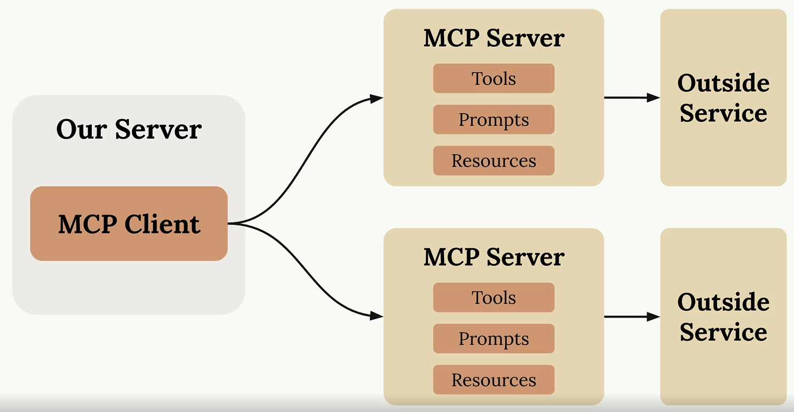

# AI/ML

## Embeddings

### What are Embeddings?

Embeddings are numerical representations of objects (words, sentences, images, etc.) in high-dimensional vector spaces. They transform discrete, categorical data into continuous, dense vectors that capture semantic meaning and relationships between objects. The key insight is that objects with similar meanings or properties should have similar vector representations, allowing mathematical operations to be performed on semantic content.

### How Do Embeddings Work?

Embeddings work by mapping discrete objects to points in a continuous vector space through learned transformations:

**Mapping Process:**
- Each object is assigned a unique vector of real numbers (typically 50-4096 dimensions)
- Similar objects are positioned close to each other in the vector space
- Dissimilar objects are positioned far apart
- The distance between vectors reflects semantic similarity

**Mathematical Foundation:**
- Embeddings use distance metrics (cosine similarity, Euclidean distance) to measure relationships
- Vector arithmetic can capture semantic relationships (e.g., king - man + woman ≈ queen)
- Dimensionality reduction techniques can visualize high-dimensional embeddings in 2D/3D space

**Context Sensitivity:**
- Traditional embeddings assign fixed vectors to objects
- Contextual embeddings (from transformers) generate dynamic vectors based on surrounding context
- The same word can have different embeddings depending on its usage

### Properties of Embeddings

**Semantic Similarity:**
- Objects with similar meanings cluster together in the vector space
- Similarity can be measured using mathematical distance functions
- Enables semantic search and content recommendation

**Compositionality:**
- Vector operations can capture semantic relationships
- Addition and subtraction of vectors can express analogies and transformations
- Enables reasoning about relationships between concepts

**Dimensionality:**
- Higher dimensions can capture more nuanced relationships
- Common dimensions range from 50 (simple tasks) to 4096+ (complex models)
- Trade-off between expressiveness and computational efficiency

**Density:**
- Dense vectors use most dimensions meaningfully (vs sparse one-hot encodings)
- More efficient storage and computation compared to sparse representations
- Better generalization to unseen data

**Transferability:**
- Pre-trained embeddings can be used across different tasks and domains
- Enable transfer learning and few-shot learning scenarios
- Reduce computational requirements for downstream applications

### How Are Embeddings Trained?

**Traditional Word Embeddings:**
- **Skip-gram/CBOW (Word2Vec):** Predict context words from target word or vice versa
- **GloVe:** Global matrix factorization combining local context window methods with global co-occurrence statistics
- **FastText:** Extends Word2Vec by considering subword information and character n-grams

**Neural Language Model Embeddings:**
- Trained as part of larger neural networks (RNNs, LSTMs) on language modeling tasks
- Embeddings emerge as internal representations in hidden layers
- Optimized through backpropagation to minimize prediction loss

**Transformer-based Embeddings:**
- **BERT:** Bidirectional training using masked language modeling and next sentence prediction
- **GPT series:** Autoregressive training predicting next tokens in sequences
- **T5:** Text-to-text unified framework training on diverse NLP tasks

**Multimodal Embeddings:**
- **CLIP:** Contrastive learning between image and text pairs
- **DALLE:** Joint training on image generation and text understanding
- Learns shared representation spaces across different modalities

**Training Objectives:**
- **Contrastive Learning:** Maximize similarity between positive pairs, minimize for negative pairs
- **Reconstruction Loss:** Minimize difference between original and reconstructed objects
- **Classification Loss:** Optimize embeddings for downstream classification tasks
- **Triplet Loss:** Ensure anchor-positive distance < anchor-negative distance

**Training Challenges:**
- **Data Quality:** Requires large, diverse, high-quality datasets
- **Computational Cost:** Training large embedding models requires significant resources
- **Evaluation:** Difficult to directly evaluate embedding quality without downstream tasks
- **Bias:** Embeddings can inherit and amplify biases present in training data

## Transformers

### What are Transformers?

Transformers are a type of neural network architecture designed to process sequential data, such as text, audio, or time-series data. They are the foundation of many state-of-the-art models in natural language processing (NLP), computer vision, and other AI fields. Introduced in the 2017 paper *"Attention is All You Need"*, transformers revolutionized AI by replacing traditional sequential models (e.g., RNNs, LSTMs) with a parallelizable architecture based on the **attention mechanism**.

Transformers are highly flexible and scalable, making them the building blocks of modern AI systems like BERT, GPT, and T5. They excel at capturing long-range dependencies and contextual relationships in data, enabling them to understand and generate complex patterns.

### How Do Transformers Work?

Transformers process input data (e.g., text or images) by encoding it into a sequence of vectors and transforming these vectors through multiple layers. The key components of a transformer are:

#### 1. **Self-Attention Mechanism**
The self-attention mechanism is the core innovation of transformers. It allows the model to focus on different parts of the input sequence when processing each token. For example, in a sentence, the model can determine which words are most relevant to the current word being processed.

- **Query, Key, and Value (Q, K, V):** Each input token is transformed into three vectors: a query, a key, and a value. The attention mechanism computes the relevance of one token to another by comparing their queries and keys, and then uses this relevance to weight the values.

- **Multi-Head Attention:** Multiple attention heads operate in parallel, allowing the model to capture different types of relationships (e.g., syntactic, semantic) within the data.

#### 2. **Positional Encoding**
Since transformers process sequences in parallel (rather than step-by-step), they need a way to encode the order of the input tokens. Positional encodings are added to the input embeddings to provide information about the position of each token in the sequence.

#### 3. **Feed-Forward Layers**
After the attention mechanism, each token is passed through a feed-forward neural network. This step processes each token independently, adding non-linear transformations to enhance the model's capacity.

#### 4. **Residual Connections and Normalization**
Residual connections and layer normalization are used to stabilize training and improve gradient flow. These techniques allow transformers to scale to very deep architectures without performance degradation.

#### 5. **Stacked Layers**
Transformers consist of multiple layers of attention and feed-forward networks. Each layer refines the representation of the input, enabling the model to capture increasingly complex patterns.

---

### Properties of Transformers

#### **Parallelization**
Transformers process entire sequences simultaneously, unlike RNNs or LSTMs, which process data sequentially. This parallelization enables faster training and inference, especially on modern hardware like GPUs and TPUs.

#### **Long-Range Dependencies**
The self-attention mechanism allows transformers to capture relationships between distant tokens in a sequence. This makes them particularly effective for tasks where context from the entire input is important.

#### **Scalability**
Transformers scale well with data and model size. Increasing the number of layers, attention heads, or parameters generally improves performance, as seen in models like GPT-3 and GPT-4.

#### **Contextual Representations**
Transformers generate dynamic, context-dependent embeddings. The same word or token can have different representations depending on its surrounding context, enabling nuanced understanding of language.

#### **Bidirectionality**
In encoder-based transformers (e.g., BERT), the model processes input bidirectionally, considering both past and future context simultaneously. This is particularly useful for understanding tasks like classification or question answering.

#### **Transfer Learning**
Transformers are pre-trained on massive datasets and fine-tuned for specific tasks. This transfer learning capability allows them to generalize across domains and perform well with limited task-specific data.

#### **Emergent Abilities**
As transformers scale, they exhibit emergent behaviors, such as few-shot learning, reasoning, and instruction-following. These abilities arise from the model's capacity to learn complex patterns in data.

---

### Variants of Transformers

#### **Encoder-Only Models (e.g., BERT)**
- Focus on understanding tasks like classification, entity recognition, and question answering.
- Process input bidirectionally to capture rich contextual information.

#### **Decoder-Only Models (e.g., GPT)**
- Designed for generative tasks like text completion, summarization, and dialogue.
- Use autoregressive processing, predicting one token at a time based on previous tokens.

#### **Encoder-Decoder Models (e.g., T5, BART)**
- Combine an encoder for understanding and a decoder for generation.
- Used for sequence-to-sequence tasks like translation, summarization, and text-to-text generation.

## Retrieval-Augmented Generation (RAG)

### What is RAG?

Retrieval-Augmented Generation (RAG) is a hybrid approach that combines **retrieval-based systems** with **generative language models** to enhance the accuracy, relevance, and factual grounding of AI-generated content. Instead of relying solely on the knowledge encoded in a pre-trained language model, RAG retrieves external information from a knowledge base or document store to supplement the model's responses.

RAG is particularly useful in scenarios where the generative model's training data may be outdated, incomplete, or insufficiently specific. By integrating retrieval mechanisms, RAG ensures that the model can access up-to-date and domain-specific information during inference.

### What Problem Does RAG Solve?

RAG addresses several key challenges in traditional generative language models:

1. **Hallucination:**
   - Generative models often "hallucinate" information, producing plausible but incorrect or fabricated responses. RAG mitigates this by grounding responses in retrieved, factual data.

2. **Outdated Knowledge:**
   - Pre-trained models are limited to the knowledge available at the time of training. RAG allows models to access external, up-to-date information, making them more relevant for dynamic or fast-changing domains.

3. **Domain-Specific Knowledge:**
   - Generative models may lack detailed knowledge of niche or specialized topics. RAG enables integration with domain-specific knowledge bases, improving performance in specialized applications.

4. **Data Efficiency:**
   - Fine-tuning large language models for specific tasks can be computationally expensive and data-intensive. RAG avoids the need for extensive fine-tuning by leveraging external data sources.

5. **Explainability:**
   - RAG improves explainability by providing references to the retrieved documents or data that informed the model's response, making it easier to verify the accuracy of the output.

### Limitations of RAG

While RAG offers significant advantages, it also has limitations:

1. **Dependency on Retrieval Quality:**
   - The quality of the generated response heavily depends on the relevance and accuracy of the retrieved documents. Poor retrieval results can lead to irrelevant or incorrect outputs.

2. **Latency:**
   - The retrieval step introduces additional latency during inference, as the system must query and process external data before generating a response.

3. **Knowledge Base Maintenance:**
   - RAG requires a well-maintained and up-to-date knowledge base or document store. Outdated or incomplete data can negatively impact the system's performance.

4. **Complexity:**
   - RAG systems are more complex to implement and maintain compared to standalone generative models. They require integration of retrieval pipelines, indexing, and storage systems.

5. **Scalability:**
   - For large-scale applications, the retrieval process can become a bottleneck, especially when querying massive knowledge bases in real-time.

6. **Context Integration:**
   - Combining retrieved information with the generative model's internal knowledge can be challenging, particularly when the retrieved data is ambiguous or conflicting.

### Frameworks for Implementing RAG

Several frameworks and tools are available to implement RAG systems, making it easier to integrate retrieval mechanisms with generative models:

#### **LangChain**
- A popular framework for building RAG pipelines.
- Provides tools for integrating language models with external data sources, such as vector databases, APIs, and document stores.
- Supports modular components for retrieval, generation, and chaining multiple tasks.
- Compatible with various vector databases like Pinecone, Weaviate, and FAISS.

#### **LlamaIndex**
- A framework for creating and managing indexes that connect external data sources (e.g., documents, databases) to language models.
- Enables efficient retrieval of relevant information for RAG applications.
- Supports hierarchical and graph-based indexing for complex data structures.
- Integrates seamlessly with language models to provide context-aware responses.

#### **LangGraph**
- A framework for building workflows and pipelines for language models.
- Focuses on chaining tasks and managing dependencies between different components of an AI system.
- Useful for orchestrating multi-step processes in RAG systems, such as retrieval, reasoning, and generation.

#### **Hugging Face Transformers**
- Offers pre-trained generative models and tools for integrating retrieval mechanisms.
- Includes libraries for fine-tuning and customizing models for RAG workflows.
- Compatible with external retrieval systems like Elasticsearch and FAISS.

#### **Haystack**
- An open-source framework for building search-based applications.
- Provides tools for document retrieval, question answering, and RAG pipelines.
- Supports integration with various backends, including Elasticsearch, Milvus, and OpenSearch.

#### **Pinecone**
- A vector database optimized for fast and scalable similarity search.
- Often used in RAG systems to store and retrieve embeddings for external knowledge.
- Provides APIs for seamless integration with generative models.

---

### Use Cases for RAG

RAG is widely used in applications that require accurate, up-to-date, and domain-specific information:

1. **Customer Support:**
   - Retrieve and generate responses based on company knowledge bases, FAQs, and documentation.

2. **Legal and Compliance:**
   - Provide grounded answers by retrieving relevant legal documents, contracts, or regulations.

3. **Healthcare:**
   - Retrieve medical literature or patient records to generate accurate and context-aware responses.

4. **Education:**
   - Generate answers to student queries by retrieving information from textbooks, research papers, or online resources.

5. **Enterprise Search:**
   - Combine generative models with document retrieval to enhance internal search systems.

6. **Dynamic Content Generation:**
   - Generate personalized or context-specific content by retrieving relevant data from external sources.

## RAG vs fine tunning LLMs

Both **Retrieval-Augmented Generation (RAG)** and **fine-tuning large language models (LLMs)** are strategies for adapting pre-trained language models to specific tasks or domains. However, they differ significantly in their approach, use cases, and trade-offs.

### Key Differences

| **Aspect**               | **RAG**                                      | **Fine-Tuning LLMs**                          |
|--------------------------|---------------------------------------------|----------------------------------------------|
| **Knowledge Source**      | External knowledge base                     | Internalized during training                 |
| **Adaptability**          | Dynamic (updates via knowledge base)        | Static (requires retraining for updates)     |
| **Latency**               | Higher (due to retrieval step)              | Lower (no retrieval step)                    |
| **Cost**                  | Lower (no model retraining)                 | Higher (requires computational resources)    |
| **Explainability**        | High (retrieved sources are referenced)     | Low (no references provided)                 |
| **Implementation Complexity** | Higher (requires retrieval system)         | Lower (model is standalone after fine-tuning)|
| **Best for**              | Dynamic, domain-specific knowledge          | Task-specific optimization                   |

---

### When to Use RAG vs Fine-Tuning

**Choose RAG if:**
- You need access to up-to-date or frequently changing information.
- Your application requires explainability and traceability of responses.
- You want to avoid the cost and complexity of fine-tuning large models.

**Choose Fine-Tuning if:**
- You have a well-defined task with a specific dataset.
- Low latency is critical for your application.
- You want a standalone model without external dependencies.

---

### Combining RAG and Fine-Tuning

In some cases, RAG and fine-tuning can be combined for optimal results:
- Fine-tune a generative model on domain-specific data to improve its baseline performance.
- Use RAG to supplement the fine-tuned model with external, up-to-date knowledge for enhanced accuracy and grounding.

This hybrid approach leverages the strengths of both methods, providing a robust solution for complex, real-world applications.

## MCP

### Overview

MCP (Model Context Protocol) is an open-source standard for connecting AI applications to external systems. Using MCP, AI applications like Claude or ChatGPT can connect to data sources (e.g. local files, databases), tools (e.g. search engines, calculators) and workflows (e.g. specialized prompts)—enabling them to access key information and perform tasks. Think of MCP like a USB-C port for AI applications. Just as USB-C provides a standardized way to connect electronic devices, MCP provides a standardized way to connect AI applications to external systems.

The great advantage of MCP servers is that they take the burden of tool definitions and execution our servers had. They provide access to data or functionality implemented by some outside service.

### What can MCP enable?
- Agents can access your Google Calendar and Notion, acting as a more personalized AI assistant.
- Claude Code can generate an entire web app using a Figma design.
- Enterprise chatbots can connect to multiple databases across an organization, empowering users to analyze data using chat.
- AI models can create 3D designs on Blender and print them out using a 3D printer.

### MCP server primitives

- **Tools**: Model-controlled. LLM decides when to call these and the results are used by the LLM. They are used to give additional functionality to the LLM.
- **Resources**: App-controlled. Our App decides when to call these. Results are used primarily by our App. Resources are used for getting data into our App and adding context to messages.
- **Prompts**: User-controlled: The user decides when to use these. Prompts are used for workflows to run based on user input, like a slash command, button click or menu option.

### MCP Client and communication

The MCP client serves as the communication bridge between your server and MCP servers. It's your access point to all the tools that an MCP server provides, handling the message exchange and protocol details so your application doesn't have to.

One of MCP's key strengths is being transport agnostic (client and server can communicate over different protocols). They can connect over standard IO (if running client and server locally), HTTP, WebSockets, etc.

The MCP server and client communicate by exchanging messages (the messages allowed are defined in the MCP spec). Some typical messages are `ListToolsRequest`/`ListToolsResult` (to know the tools available in the server) and `CallToolRequest`/`CallToolResult` (to run a particular tool with arguments).

## LLM Cache

### What is LLM Cache?

**LLM Cache** is a mechanism to store and reuse the results of previous queries to large language models (LLMs). It reduces the need for repeated computations, improving performance, lowering costs, and enhancing scalability in applications that rely on LLMs.

---

### Why is LLM Caching Important?

1. **Reduced Latency:** Faster responses by avoiding redundant computations.
2. **Cost Efficiency:** Fewer API calls or computational resources required.
3. **Scalability:** Handles higher traffic loads efficiently.
4. **Consistency:** Ensures identical queries yield consistent outputs.
5. **Improved User Experience:** Faster and more reliable responses.

---

### How It Works

1. **Query Hashing:** Generate a unique identifier for each query.
2. **Cache Lookup:** Check if the result exists in the cache.
3. **Cache Hit:** Return the stored result immediately.
4. **Cache Miss:** Query the LLM and store the result in the cache.
5. **Cache Expiry:** Remove outdated results after a set time-to-live (TTL).

---

### Challenges

1. **Cache Invalidation:** Managing outdated or irrelevant data.
2. **Storage Overhead:** Large-scale caching can consume significant resources.
3. **Query Variability:** Slight changes in queries can lead to cache misses.
4. **Context Sensitivity:** Multi-turn conversations make caching more complex.

---

### Tools for LLM Caching

- **Redis:** High-performance in-memory caching.
- **LangChain:** Built-in caching for LLM queries.
- **Vector Databases (e.g., Pinecone):** Store embeddings for efficient retrieval.

## NLP evolution timeline (before and after ChatGPT)

## LLMs architecture

## LLM training stages (pre-training, RL post-training for alignment and RLVR)

## AI-Agents

## Test-time scaling vs data/size scaling

## Pytorch (training and inference)
