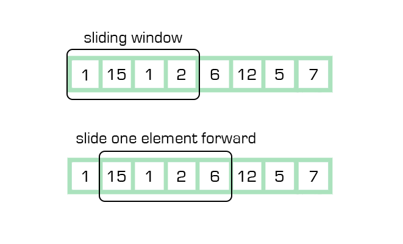

# ALGORITHMS

---

## **Algorithm Complexity and Big O Notation**

Algorithm complexity is a way to measure the performance of an algorithm based on how much time does the algorithm take (**Time Complexity**) and how much memory does it use (*Space Complexity*). It allows us to compare algorithms to decide which is the best option to implement. Instead of giving the exact seconds or bytes, complexity is measured relative to the size of the input (n).

Big O notation allows us to give the algorithm complexity a nomenclature to describes how the time (or space) grows as the input size increases which eases the comparation between algorithms.
It focuses on asymptotic behavior: what happens when n becomes very large (worst case scenario). To get the complexity of an algorithm we just take the greatest term of complexity and ignore constant terms. For example:

$f(n) = 3n2 + 2n + 1000Logn +  5000$
- After ignoring lower order terms, we get the highest order term as 3n2
- After ignoring the constant 3, we get n2
- Therefore the Big O value of this expression is $O(n^2)$

Some typical algorithms complexities are:

| Type         | Notation   | Example Algorithms                                                                                       |
|--------------|------------|------------------------------------------------------------------------------------------------------|
| Logarithmic  | O(log n)   | Binary Search                                                                                          |
| Linear       | O(n)       | Linear Search                                                                                          |
| Superlinear  | O(n log n) | Heap Sort, Merge Sort                                                                                  |
| Polynomial   | O(n^c)    | Strassen’s Matrix Multiplication, Bubble Sort, Selection Sort, Insertion Sort, Bucket Sort |
| Exponential  | O(c^n)     | Tower of Hanoi                                                                                          |
| Factorial    | O(n!)      | Determinant Expansion by Minors, Brute force Search algorithm for Traveling Salesman Problem |

---

## **Search & Traversal Algorithms**

### Binary Search

#### [Implementation and examples](./algorithms/binarysearch.py)


Binary Search is a searching algorithm that operates on a sorted or monotonic search space, repeatedly dividing it into halves to find a target value or optimal answer in logarithmic time O(log N). To apply Binary Search algorithm:

- The data structure must be sorted.
- Access to any element of the data structure should take constant time.

1. Divide the search space into two halves by finding the middle index "mid". 
2. Compare the middle element of the search space with the key. 
3. If the key is found at middle element, the process is terminated.
4. If the key is not found at middle element, choose which half will be used as the next search space.
    - If the key is smaller than the middle element, then the left side is used for next search.
    - If the key is larger than the middle element, then the right side is used for next search.
5. This process is continued until the key is found or the total search space is exhausted.

Time Complexity: 
- Best Case: O(1)
- Average Case: O(log N)
- Worst Case: O(log N)

Auxiliary Space: O(1), If the recursive call stack is considered then the auxiliary space will be O(log N).

### Binary Tree BFS

https://github.com/TheAlgorithms/Python/blob/master/graphs/breadth_first_search.py

https://github.com/TheAlgorithms/Python/blob/master/graphs/breadth_first_search_2.py

Breadth-First Search (BFS or Level Order Traversal) for Binary Trees is one of the two main ways to traverse nodes of the Binary Tree (Hierarchical data structure in which each node has at most two children, referred to as the left child and the right child). In BFS the traversing is done such that all nodes present in the same level are traversed completely before traversing the next level.

To traverse all the nodes of a lower level before moving to any of the nodes of a higher level a recursive or a iterative algorithm can be implemented:

Binary Tree definition:

```
class Node:
    def __init__(self, value):
        self.data = value
        self.left = None
        self.right = None

if __name__ == "__main__":
    # Create binary tree
    #      1         
    #     / \       
    #    3   2      
    #          \   
    #           4
    #          /  \
    #         6    5
    root = Node(1)
    root.left = Node(3)
    root.right = Node(2)
    root.right.right = Node(4)
    root.right.right.left = Node(6)
    root.right.right.right = Node(5)

    # Perform level order traversal
    res = levelOrder(root)

    # Print the result
    for level in res:
        for data in level:
            print(data, end=" ")
```

1. Stack (Recursive) implementation:

The idea is to traverse the tree recursively, passing the current node and its level, starting with the root at level 0. For each visited node, its value is added to the result array, by considering the value of current level as an index in the result array.


```
def levelOrderRec(root, level, res):
    if not root:
        return

    # Add a new level to the result if needed
    if len(res) <= level:
        res.append([])

    # Add current node's data to its corresponding level
    res[level].append(root.data)

    # Recur for left and right children
    levelOrderRec(root.left, level + 1, res)
    levelOrderRec(root.right, level + 1, res)

# Function to perform level order traversal
def levelOrder(root):
    res = []
    levelOrderRec(root, 0, res)
    return res

>> 1 3 2 4 6 5
```

2. Queue (Iterative) implementation:

Looking at the examples, it’s clear that tree nodes need to be traversed level by level from top to bottom. Since the tree structure allows us to access nodes starting from the root and moving downward, this process naturally follows a First-In-First-Out (FIFO) order. So we can use queue data structure to perform level order traversal.


```
def levelOrder(root):
    if root is None:
        return []

    # Create an empty queue for level order traversal
    q = deque()
    res = []

    # Enqueue Root
    q.append(root)
    currLevel = 0

    while q:
        len_q = len(q)
        res.append([])

        for _ in range(len_q):
            # Add front of queue and remove it from queue
            node = q.popleft()
            res[currLevel].append(node.data)

            # Enqueue left child
            if node.left is not None:
                q.append(node.left)

            # Enqueue right child
            if node.right is not None:
                q.append(node.right)
        currLevel += 1

    return res

>> 1 3 2 4 6 5
```

---

### Binary Tree DFS

https://github.com/TheAlgorithms/Python/blob/master/graphs/depth_first_search.py

https://github.com/TheAlgorithms/Python/blob/master/graphs/depth_first_search_2.py

Depth-first search is the other main technique used for traversing trees or graphs that differs from BFS in that it uses backtracking for traversal. In this traversal first, the deepest node is visited and then backtracks to its parent node if no sibling of that node exists. There are three ways to implement DFS:

1. Inorder Traversal:
    - Traverse the left subtree, i.e., call Inorder(left-subtree)
    - Visit the root
    - Traverse the right subtree, i.e., call Inorder(right-subtree)

```
def printInorder(root):
    if root:
        # First recur on left child
        printInorder(root.left)

        # then print the data of node
        print(root.val),

        # now recur on right child
        printInorder(root.right)

>> Inorder traversal of binary tree is
    4 2 5 1 3
```

2. Preorder Traversal:
    - Visit the root
    - Traverse the left subtree, i.e., call Preorder(left-subtree)
    - Traverse the right subtree, i.e., call Preorder(right-subtree)

```
def printPreorder(root):
    if root:
        # First print the data of node
        print(root.val),

        # Then recur on left child
        printPreorder(root.left)

        # Finally recur on right child
        printPreorder(root.right)

>> Preorder traversal of binary tree is
    1 2 4 5 3
```

3. Postorder Traversal:
    - Traverse the left subtree, i.e., call Postorder(left-subtree)
    - Traverse the right subtree, i.e., call Postorder(right-subtree)
    - Visit the root.


```
def printPostorder(root):
    if root:
        # First recur on left child
        printPostorder(root.left)

        # the recur on right child
        printPostorder(root.right)

        # now print the data of node
        print(root.val)

>> Postorder traversal of binary tree is
    4 5 2 3 1
```

---

### Topological Sort

https://github.com/TheAlgorithms/Python/blob/master/sorts/topological_sort.py

Topological sorting for Directed Acyclic Graph (DAG - Graph with vertices and edges, with each edge directed from one vertex to another, such that following those directions will never form a closed loop) is a linear ordering of vertices such that for every directed edge uv, vertex u comes before v in the ordering. Topological Sorting for a graph is not possible if the graph is not a DAG.

---

### Modified Binary Search

A modified binary search algorithm is a variation of the standard binary search, adapted to solve specific problems or work on specialized data structures. It builds upon the efficiency of binary search (O(log n) time complexity) by making adjustments to handle scenarios beyond a simple sorted array. These modifications often involve handling rotated arrays, finding the first or last occurrence of an element or searching in nearly sorted arrays.

```
def modified_binary_search(arr, target):
    low, high = 0, len(arr) - 1
    while low <= high:
        mid = (low + high) // 2
        if arr[mid] == target:
            return mid
        elif arr[mid] < target:
            low = mid + 1
        else:
            high = mid - 1
    return -1

# Example usage
arr = [10, 20, 30, 40, 50, 60, 70]
target = 40
result = modified_binary_search(arr, target)
print(f"Element found at index: {result}")
```


## **Sorting & Selection Algorithms**

### Quick Sort

---
QuickSort is a sorting algorithm based on the Divide and Conquer principle (breaking down the problem into smaller sub-problems) that picks an element as a pivot and partitions the given array around the picked pivot by placing the pivot in its correct position in the sorted array.

1. Choose a Pivot: Select an element from the array as the pivot (e.g., first element, last element, random element, or median).
2. Partition the Array: Rearrange the array around the pivot. After partitioning, all elements smaller than the pivot will be on its left, and all elements greater than the pivot will be on its right. The pivot is then in its correct position, and we obtain the index of the pivot.
3. Recursively Call: Recursively apply the same process to the two partitioned sub-arrays (left and right of the pivot).
4. Base Case: The recursion stops when there is only one element left in the sub-array, as a single element is already sorted.

```
# Partition function
def partition(arr, low, high):
    
    # Choose the pivot
    pivot = arr[high]
    
    # Index of smaller element and indicates
    # the right position of pivot found so far
    i = low - 1
    
    # Traverse arr[low..high] and move all smaller
    # elements to the left side. Elements from low to
    # i are smaller after every iteration
    for j in range(low, high):
        if arr[j] < pivot:
            i += 1
            swap(arr, i, j)
    
    # Move pivot after smaller elements and
    # return its position
    swap(arr, i + 1, high)
    return i + 1

# Swap function
def swap(arr, i, j):
    arr[i], arr[j] = arr[j], arr[i]

# The QuickSort function implementation
def quickSort(arr, low, high):
    if low < high:
        
        # pi is the partition return index of pivot
        pi = partition(arr, low, high)
        
        # Recursion calls for smaller elements
        # and greater or equals elements
        quickSort(arr, low, pi - 1)
        quickSort(arr, pi + 1, high)

# Main driver code
if __name__ == "__main__":
    arr = [10, 7, 8, 9, 1, 5]
    n = len(arr)

    quickSort(arr, 0, n - 1)
    
    for val in arr:
        print(val, end=" ")
```

---

### Quick Select

Quick Select Algorithm is a variation of QuickSort. The difference is, instead of recurring for both sides (after finding pivot), it recurs only for the part that contains the k-th smallest element. The logic is simple, if index of the partitioned element is more than k, then we recur for the left part. If index is the same as k, we have found the k-th smallest element and we return. If index is less than k, then we recur for the right part. This reduces the expected complexity from O(n log n) to O(n), with a worst-case of O(n^2).

```
# Standard partition process of QuickSort(). It considers the last element as pivot and moves all smaller element to left of it and greater elements to right
def partition(arr, l, r):
    
    x = arr[r]
    i = l
    for j in range(l, r):
        
        if arr[j] <= x:
            arr[i], arr[j] = arr[j], arr[i]
            i += 1
            
    arr[i], arr[r] = arr[r], arr[i]
    return i

# Finds the kth position (of the sorted array) in a given unsorted array i.e this function. It can be used to find both kth largest and kth smallest element in the array. ASSUMPTION: all elements in arr[] are distinct
def kthSmallest(arr, l, r, k):

    # if k is smaller than number of
    # elements in array
    if (k > 0 and k <= r - l + 1):

        # Partition the array around last
        # element and get position of pivot
        # element in sorted array
        index = partition(arr, l, r)

        # if position is same as k
        if (index - l == k - 1):
            return arr[index]

        # If position is more, recur
        # for left subarray
        if (index - l > k - 1):
            return kthSmallest(arr, l, index - 1, k)

        # Else recur for right subarray
        return kthSmallest(arr, index + 1, r,
                            k - index + l - 1)
    print("Index out of bound")

# Driver Code
arr = [ 10, 4, 5, 8, 6, 11, 26 ]
n = len(arr)
k = 3
print("K-th smallest element is ", end = "")
print(kthSmallest(arr, 0, n - 1, k))

```

## **Array/List Processing Patterns**

### Prefix Sum

https://github.com/TheAlgorithms/Python/blob/master/data_structures/arrays/prefix_sum.py

The prefix sum, cumulative sum, inclusive scan, or simply scan of a sequence of numbers x0, x1, x2, ... is a second sequence of numbers y0, y1, y2, ..., the sums of prefixes (running totals) of the input sequence:

- $y0 = x0$
- $y1 = x0 + x1$
- $y2 = x0 + x1+ x2$

```
a = [3, 4, 1, 7, 9, 1]

res = []
cur_s= 0 # current sum

for num in a:
    cur_s += num
    res.append(cur_s)
print(res)

>> [3, 7, 8, 15, 24, 25]
```

---

### Two pointers algorithm

#### [Implementation and examples](./algorithms/twopointers.py)


The Two-Pointers Technique is a simple yet powerful strategy where you use two indices (pointers) that traverse a data structure—such as an array, list, or string—either toward each other or in the same direction to solve problems more efficiently. Generally, two-pointer algorithms have the following characteristics:

- Two moving pointers, regardless of directions, moving dependently or independently;
- A function that utilizes the entries referenced by the two pointers, which relates to the answer in a way;
- An easy way of deciding which pointer to move;
- A way to process the array when the pointers are moved.

Time complexity = $O(n)$, because each pointer will, at most, traverse the array once. Therefore, combined, they will traverse it twice. However, when evaluating time complexity, constants are dropped, and hence it’s $O(n)$

Typical case scenarios to use two-pointers are:

- Sorted Input : If the array or list is already sorted (or can be sorted), two pointers can efficiently find pairs or ranges. Example: Find two numbers in a sorted array that add up to a target.
- Pairs or Subarrays : When the problem asks about two elements, subarrays, or ranges instead of working with single elements. Example: Longest substring without repeating characters, maximum consecutive ones, checking if a string is palindrome.
- Sliding Window Problems : When you need to maintain a window of elements that grows/shrinks based on conditions. Example: Find smallest subarray with sum ≥ K, move all zeros to end while maintaining order.
- Linked Lists (Slow–Fast pointers) : Detecting cycles, finding the middle node, or checking palindrome property. Example: Floyd’s Cycle Detection Algorithm (Tortoise and Hare).


---

### Sliding window

#### [Implementation and examples](./algorithms/slidingwindow.py)



Sliding Window is an extension of the Two-pointers algorithm used to solve problems that involve subarray or substring or window. The main idea is to use the results of previous window to do computations for the next window. This technique is commonly used in algorithms like finding subarrays with a specific sum, finding the longest substring with unique characters, or solving problems that require a fixed-size window to process elements efficiently.

There are basically two types of sliding window:

1. Fixed Size Sliding Window:
- Find the size of the window required, say K.
- Compute the result for 1st window, i.e. include the first K elements of the data structure.
- Then use a loop to slide the window by 1 and keep computing the result window by window.

2. Variable Size Sliding Window:
- In this type of sliding window problem, we increase our right pointer one by one till our condition is true.
- At any step if our condition does not match, we shrink the size of our window by increasing left pointer.
- Again, when our condition satisfies, we start increasing the right pointer and follow step 1.
- We follow these steps until we reach to the end of the array.


## **Data Structure Specific Algorithms**

### Linked List In-Place Reversal

In-place reversal of a linked list is a technique where we reverse the direction of the links between nodes without using any additional data structure. This approach has several advantages:

- Space Efficiency: It doesn't require extra space proportional to the size of the list.
- Time Efficiency: It can be done in a single pass through the list.
- Demonstrates Understanding: It shows a deep grasp of pointer manipulation and linked list concepts.

```
class ListNode:
    def __init__(self, val=0, next=None):
        self.val = val
        self.next = next

def reverseLinkedList(head):
    prev = None
    current = head
    
    while current is not None:
        next = current.next
        current.next = prev
        prev = current
        current = next
    
    return prev  # prev is now the new head

# Helper function to create a linked list from a list of values
def createLinkedList(values):
    dummy = ListNode(0)
    current = dummy
    for val in values:
        current.next = ListNode(val)
        current = current.next
    return dummy.next

# Helper function to convert a linked list to a list for easy printing
def linkedListToList(head):
    result = []
    current = head
    while current:
        result.append(current.val)
        current = current.next
    return result

# Test the reversal
original_list = createLinkedList([1, 2, 3, 4, 5])
reversed_list = reverseLinkedList(original_list)

print("Original list:", linkedListToList(original_list))
print("Reversed list:", linkedListToList(reversed_list))
```

---

## **Monotonic Stack**

A Monotonic Stack is a data structure used to maintain elements in a monotonically increasing or decreasing order. It's particularly useful in problems like finding the next or previous greater or smaller elements.

- Monotonic Increasing Stack: Stack where elements are placed in increasing order from the bottom to the top. If a new element is smaller than the current top element, elements are popped from the stack until the stack maintains its increasing order.

```
def monotonic_increasing_stack(arr):
    # Initialize an empty stack to maintain the increasing order
    stack = []
    
    # Iterate through each element in the input array
    for num in arr:
        # While the stack is not empty and the top of the stack is greater than the current element
        while stack and stack[-1] > num:
            # Pop the top element from the stack
            stack.pop()
        # Push the current element onto the stack
        stack.append(num)
    
    # Return the stack, which now contains elements in monotonic increasing order
    return stack

# Example usage
arr = [2, 1, 2, 4, 3]
print(monotonic_increasing_stack(arr))
```

- Monotonic Decreasing Stack: Stack where elements are placed in decreasing order from the bottom to the top. If a new element is greater than the current top element, elements are popped from the stack until the stack maintains its decreasing order.

```
def monotonic_decreasing_stack(arr):
    # Initialize an empty stack to maintain the decreasing order
    stack = []

    # Iterate through each element in the input array
    for num in arr:
        # While the stack is not empty and the top of the stack is less than the current element
        while stack and stack[-1] < num:
            # Pop the top element from the stack
            stack.pop()
        # Push the current element onto the stack
        stack.append(num)

    # Return the stack, which now contains elements in monotonic decreasing order
    return stack


# Example usage
arr = [2, 1, 2, 4, 3]
print(monotonic_decreasing_stack(arr))
```

## **Matrix Processing Algorithms**

## **Spiral Matrix Traversal**

Spiral matrix traversal is a method of visiting all elements in a matrix by following a spiral path from the outer elements towards the center. This pattern is often used in problems related to image processing, data compression, and even in some game algorithms.

The spiral pattern typically starts from the top-left corner of the matrix and moves in a clockwise direction. The traversal follows these steps:

1. Move right along the top row
2. Move down along the right column
3. Move left along the bottom row
4. Move up along the left column
5. Repeat steps 1-4 for inner layers until all elements are visited


Time Complexity: O(m * n), where m is the number of rows and n is the number of columns. We visit each element exactly once.
Space Complexity: O(1) if we don’t count the space used to store the result. If we include the result array, it becomes O(m * n).


```
def spiral_traverse(matrix):
    if not matrix:
        return []

    result = []
    top, bottom = 0, len(matrix) - 1
    left, right = 0, len(matrix[0]) - 1

    while top <= bottom and left <= right:
        # Traverse top row
        for col in range(left, right + 1):
            result.append(matrix[top][col])
        top += 1

        # Traverse right column
        for row in range(top, bottom + 1):
            result.append(matrix[row][right])
        right -= 1

        if top <= bottom:
            # Traverse bottom row
            for col in range(right, left - 1, -1):
                result.append(matrix[bottom][col])
            bottom -= 1

        if left <= right:
            # Traverse left column
            for row in range(bottom, top - 1, -1):
                result.append(matrix[row][left])
            left += 1

    return result

# Example usage
matrix = [
    [1, 2, 3, 4],
    [5, 6, 7, 8],
    [9, 10, 11, 12],
    [13, 14, 15, 16]
]

print(spiral_traverse(matrix))
# Output: [1, 2, 3, 4, 8, 12, 16, 15, 14, 13, 9, 5, 6, 7, 11, 10]
```

---

## **Diagonal Matrix Traversal**

Diagonal matrix traversal involves visiting elements along the diagonals of a matrix. This pattern is useful in various applications, including image processing and certain mathematical computations. The algorithm can be main diagonal traversal (top-left to bottom-right) and anti-diagonal traversal (from top-right to bottom-left). The anti-diagonal algorithm is:


1. Start with the top-right element of the matrix
2. For each diagonal:
    - Initialize row to 0 and column to the current diagonal
    - While row is less than the number of rows and column is greater than or equal to 0:
        - Visit the element at (row, column)
        - Increment row and decrement column
3. Repeat step 2 for all diagonals, moving the starting point down the right edge and then along the bottom edge


Time Complexity: O(m * n), as we visit each element once.
Space Complexity: O(1) excluding the result array, or O(m * n) including it.


```
def diagonal_traverse(matrix):
    if not matrix or not matrix[0]:
        return []

    m, n = len(matrix), len(matrix[0])
    result = []

    # Traverse the top-right half of the matrix
    for d in range(n):
        row, col = 0, d
        while row < m and col >= 0:
            result.append(matrix[row][col])
            row += 1
            col -= 1

    # Traverse the bottom-left half of the matrix
    for d in range(1, m):
        row, col = d, n - 1
        while row < m and col >= 0:
            result.append(matrix[row][col])
            row += 1
            col -= 1

    return result

# Example usage
matrix = [
    [1, 2, 3, 4],
    [5, 6, 7, 8],
    [9, 10, 11, 12],
    [13, 14, 15, 16]
]

print(diagonal_traverse(matrix))
# Output: [4, 3, 8, 2, 7, 12, 1, 6, 11, 16, 5, 10, 15, 9, 14, 13]
```


---

## **ZigZag Matrix Traversal**

Zigzag matrix traversal, also known as wave traversal, involves visiting matrix elements in a zigzag pattern. This traversal method is often used in image processing and data compression algorithms. The zigzag pattern typically follows these rules:

1. Start from the top-left corner of the matrix
2. Move diagonally up and right until reaching the top row or right column
3. Move down or right (depending on which boundary was reached)
4. Move diagonally down and left until reaching the bottom row or left column
5. Move right or down (depending on which boundary was reached)
6. Repeat steps 2-5 until all elements are visited


Time Complexity: O(m * n), since we visit each element once.
Space Complexity: O(1) not counting the result array, or O(m * n) with it.


```
def zigzag_traverse(matrix):
    if not matrix or not matrix[0]:
        return []

    m, n = len(matrix), len(matrix[0])
    result = []
    row, col = 0, 0
    going_up = True

    while len(result) < m * n:
        result.append(matrix[row][col])

        if going_up:
            if row > 0 and col < n - 1:
                row -= 1
                col += 1
            else:
                going_up = False
                if col == n - 1:
                    row += 1
                else:
                    col += 1
        else:
            if row < m - 1 and col > 0:
                row += 1
                col -= 1
            else:
                going_up = True
                if row == m - 1:
                    col += 1
                else:
                    row += 1

    return result

# Example usage
matrix = [
    [1, 2, 3, 4],
    [5, 6, 7, 8],
    [9, 10, 11, 12],
    [13, 14, 15, 16]
]

print(zigzag_traverse(matrix))
# Output: [1, 2, 5, 9, 6, 3, 4, 7, 10, 13, 14, 11, 8, 12, 15, 16]
```

## **Optimization & Problem-Solving Paradigms**

### Top K Elements

The "Top K Elements" algorithm efficiently identifies the k most frequent or largest elements within a dataset. It leverages data structures like heaps (Heap property ensures that for any given node, its value is either greater than or equal to (max-heap) or less than or equal to (min-heap) the values of its children. Heaps are commonly used to implement priority queues and are often represented as complete binary trees, which can also be represented using arrays.) or quickselect to achieve optimal time complexity, often outperforming sorting the entire input. This pattern is widely applicable for tasks like finding popular items, trending topics, or analyzing data distributions.

https://www.geeksforgeeks.org/dsa/find-k-numbers-occurrences-given-array/
- [Naive Approach] Using hash map and Sorting
- [Expected Approach 1] Using hash map and Max Heap
- [Expected Approach 2] Using Counting sort
- [Alternate Approach] Using Quick Select

https://github.com/TheAlgorithms/Python/blob/master/strings/top_k_frequent_words.py

---

### Overlapping Intervals

Overlapping Intervals ussually refers to two common problems:

- Detect overlaps in a range list
- Merge overlapping ranges into a compact, redundancy-free version.

1. Detect overlaps in a range list : You sort the intervals by their start. Then you iterate through and compare the start of the current interval with the end of the previous one: if the start is before the previous end, there is an overlap. Complexity O(n log n).

```
def hay_solapamiento(intervalos):
    if not intervalos:
        return False
    # Ordenar por inicio
    intervalos.sort(key=lambda x: x[0])
    prev_end = intervalos[0][1]
    for start, end in intervalos[1:]:
        if start < prev_end:  # overlap
            return True
        prev_end = max(prev_end, end)
    return False

# Ejemplo
intervalos = [(1, 3), (2, 4), (5, 6)]
print(hay_solapamiento(intervalos))  # True

```

2. Merge overlapping ranges into a compact, redundancy-free version: You sort by start and build a resulting list by extending the current interval if there is overlap. Complexity O(n).

```
def fusionar_intervalos(intervalos):
    if not intervalos:
        return []
    intervalos.sort(key=lambda x: x[0])
    resultado = []
    current_start, current_end = intervalos[0]
    for start, end in intervalos[1:]:
        if start <= current_end:  # hay solapamiento
            current_end = max(current_end, end)
        else:
            resultado.append((current_start, current_end))
            current_start, current_end = start, end
    resultado.append((current_start, current_end))
    return resultado

# Ejemplo
intervalos = [(1, 3), (2, 4), (5, 6), (5, 8)]
print(fusionar_intervalos(intervalos))  # [(1, 4), (5, 8)]
```

---


---

### Backtracking

Backtracking is a problem-solving algorithmic technique that involves finding a solution incrementally by trying different options and undoing them if they lead to a dead end. The backtracking algorithm is a recursive algorithm that is used to solve problems by making a series of choices, and if a choice leads to a dead end, it backtracks to the last valid choice made and tries a different path. It is often used to solve problems such as searching for a path in a maze, the N-Queens puzzle, Sudoku, and the Knight's Tour.

1. Choose an initial solution.
2. Explore all possible extensions of the current solution.
3. If an extension leads to a solution, return that solution.
4. If an extension does not lead to a solution, backtrack to the previous solution and try a different extension.
5. Repeat steps 2-4 until all possible solutions have been explored.

```
# Given an integer n, the task is to find the solution to the n-queens problem,
# where n queens are placed on an n*n chessboard such that no two queens can attack each other.

# Input: 4
# Output: [2, 4, 1, 3]
# Explanation: [2, 4, 1, 3 ] and [3, 1, 4, 2] are the two possible solutions.

# Input: 1
# Output: [1]
# Explanation: Only one queen can be placed in the single cell available.

def is_safe(board, row, col, N):
    # Check this row on the left side
    for i in range(col):
        if board[row][i] == 'Q':
            return False

    # Check upper diagonal on left side
    for i, j in zip(range(row, -1, -1), range(col, -1, -1)):
        if board[i][j] == 'Q':
            return False

    # Check lower diagonal on left side
    for i, j in zip(range(row, N, 1), range(col, -1, -1)):
        if board[i][j] == 'Q':
            return False

    return True


def solve_n_queens(N):
    board = [['.' for _ in range(N)] for _ in range(N)]
    result = []

    def backtrack(board, col):
        if col == N:
            result.append([''.join(row) for row in board])
            return

        for i in range(N):
            if is_safe(board, i, col, N):
                board[i][col] = 'Q'
                backtrack(board, col + 1)
                board[i][col] = '.'

    backtrack(board, 0)
    return result


# Example 1
N1 = 4
result1 = solve_n_queens(N1)
print(f"Solution for Example 1 with N = {N1}:")
for solution in result1:
    print(solution)
print()

# Example 2
N2 = 1
result2 = solve_n_queens(N2)
print(f"Solution for Example 2 with N = {N2}:")
for solution in result2:
    print(solution)
```

---

### Dynamic Programming

Dynamic Programming (DP) is a method for solving problems by breaking them down into overlapping subproblems, solving each subproblem once, and storing its result to avoid recomputation. It is especially useful when:

- The problem has overlapping subproblems (the same subproblems appear multiple times in the recursion tree).
- The problem has optimal substructure (the optimal solution to the problem can be built from optimal solutions of its subproblems).

The key approaches are:

- Top-Down (Memoization)
    - Start with the original problem.
    - Recursively solve subproblems.
    - Store their results (memoize) to avoid recomputing.
    - O(n) Time and O(n) Space
- Bottom-Up (Tabulation)
    - Solve smaller subproblems first.
    - Use their results to build up to the final solution.
    - Usually iterative.
    - O(n) Time and O(n) Space

Typical Use Cases
    - Combinatorics & Counting: Fibonacci numbers, number of ways to climb stairs.
    - Optimization: Knapsack problem, coin change, matrix chain multiplication.
    - Pathfinding: Minimum path sum in a grid, shortest paths in weighted graphs (e.g., Floyd–Warshall).
    - String Processing: Longest common subsequence, edit distance.
    - Game Theory: Minimax with memoization.

Pros:
- Reduces time complexity by avoiding redundant calculations.
- Often transforms exponential-time recursive solutions into polynomial-time.
- Conceptually simpler than some other optimizations like divide & conquer with complex pruning.

Cons:
- Requires extra memory (for the table or memo).
- May be overkill for problems without overlapping subproblems.
- Can be tricky to identify the correct recurrence relation.

Memoization Fibonacci:
```
# Python program to find fibonacci number using memoization.
def fibRec(n, memo):
    # Base case
    if n <= 1:
        return n

    # To check if output already exists
    if memo[n] != -1:
        return memo[n]

    # Calculate and save output for future use
    memo[n] = fibRec(n - 1, memo) + fibRec(n - 2, memo)
    return memo[n]

def fib(n):
    memo = [-1] * (n + 1)
    return fibRec(n, memo)

n = 5
print(fib(n))
```

Tabulation Fibonacci:
```
# Python program to find fibonacci number using tabulation.
def fibo(n):
    dp = [0] * (n + 1)

    # Storing the independent values in dp
    dp[0] = 0
    dp[1] = 1

    # Using the bottom-up approach
    for i in range(2, n + 1):
        dp[i] = dp[i - 1] + dp[i - 2]
    
    return dp[n]

n = 5
print(fibo(n))
```