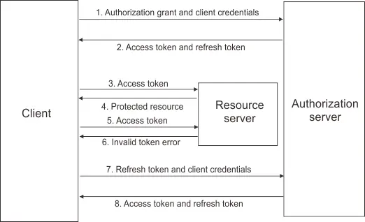

# Web Apps

## Sync servers vs Async servers

## Websockets

## Request life cycle

When a client sends a request to a web server and receives a response, a sophisticated orchestration of components works together behind the scenes. Understanding this lifecycle is crucial for web developers to optimize performance, debug issues, and design scalable architectures.

### The Journey Overview

The request lifecycle involves several distinct layers of infrastructure, each handling specific responsibilities. At the front sits the web server, which manages incoming connections and protocol handling. Behind it, an application server hosts the actual business logic written in frameworks like Django, Flask, or FastAPI. Between these components, various protocols and middleware components facilitate communication and add cross-cutting functionality.

### 1. Web Server Layer

The process begins when a web server process monitors specific network ports for incoming HTTP requests. Popular web servers include **Nginx**, **Apache HTTP Server**, and **Caddy**. These servers excel at handling thousands of concurrent connections efficiently, managing SSL/TLS termination, serving static files, and implementing load balancing strategies.

When a request arrives, the web server performs initial protocol parsing, validates the HTTP format, handles connection keep-alive semantics, and manages SSL certificate validation for HTTPS connections. Modern web servers like Nginx use event-driven architectures that can handle tens of thousands of concurrent connections without creating individual threads for each request.

The web server also implements critical security features such as rate limiting, request size restrictions, and basic filtering of malicious requests before they reach the application layer. Additionally, it often serves static assets (CSS, JavaScript, images) directly from the filesystem without involving the application server, significantly improving performance for these resources.

### 2. Application Gateway Interface

Once the web server processes the initial request, it needs to communicate with the application server. This communication happens through standardized protocols that abstract the differences between various web servers and application frameworks.

For traditional synchronous Python applications, the **WSGI (Web Server Gateway Interface)** protocol serves as the bridge. Popular web servers that include WSGI include **Gunicorn** and **uWSGI**. These servers spawn multiple worker processes, each capable of handling one request at a time, providing isolation and fault tolerance.

For asynchronous applications, **ASGI (Asynchronous Server Gateway Interface)** enables handling of long-lived connections and concurrent request processing within a single worker. **Uvicorn** are prominent ASGI servers that support modern async frameworks like FastAPI, and async-enabled Django.

### Application Server Processing

The application server hosts the actual business logic written using web frameworks such as **Django**, **Flask** or **FastAPI**. This layer contains the custom code that developers write to handle specific business requirements.

The request first encounters the framework's routing system, which matches the incoming URL pattern to specific handler functions or class methods. Modern frameworks use efficient routing algorithms, often implementing trie data structures or compiled regular expressions for fast lookup performance.

Before reaching the business logic, requests typically pass through a middleware pipeline. Middleware components handle cross-cutting concerns such as authentication, authorization, logging, request parsing, CORS headers, and security validations. Each middleware can modify the request, add contextual information, or short-circuit the pipeline if certain conditions aren't met.

The core business logic then processes the request, potentially involving database queries, external API calls, file system operations, or complex computations. This is where the application-specific functionality lives—user authentication, data processing, business rule enforcement, and response generation.

### Response Journey

After the application generates a response, it travels back through the same pipeline in reverse. The framework serializes the response data (JSON for APIs, HTML for web pages), sets appropriate headers including caching directives and security headers, and passes the response back through the middleware stack.

The application server sends the response through the gateway interface (WSGI/ASGI) back to the web server, which handles final compression (gzip, Brotli), adds server-specific headers, and transmits the data back to the client over the established TCP connection.

### Abstraction Benefits

This layered architecture provides clear separation of concerns. Web servers handle low-level networking, protocol compliance, and infrastructure concerns that are common across all web applications. Application servers focus on request routing, middleware processing, and providing convenient APIs for developers. The gateway interfaces ensure portability, allowing applications to run on different server combinations without code changes.

Developers can concentrate solely on business logic implementation while the infrastructure handles connection management, protocol parsing, SSL termination, static file serving, and other operational concerns. This separation enables better scalability, as each layer can be optimized and scaled independently based on specific performance requirements.

### Request Lifecycle Diagram

```
Client Request
     ↓
┌─────────────────┐
│   Web Server    │ ← Nginx, Apache, Caddy
│ - SSL/TLS       │
│ - Load Balance  │
│ - Static Files  │
│ - Rate Limiting │
└─────────────────┘
     ↓ HTTP
┌─────────────────┐
│ Gateway Interface│ ← WSGI (Gunicorn, uWSGI)
│ (WSGI/ASGI)     │   ASGI (Uvicorn, Daphne)
└─────────────────┘
     ↓ Protocol
┌─────────────────┐
│ Application     │ ← Django, Flask, FastAPI
│ Framework       │
│ - Routing       │
│ - Middleware    │
│ - Business Logic│
└─────────────────┘
     ↓ Response
    Client
```

This architecture ensures that each component operates within its area of expertise, creating a robust, scalable, and maintainable web application infrastructure.

## Authorization

## wsgi vs asgi

## Websockets

## Idempotency

Se tiene una API de procesamiento de pagos:

1. User places order
2. Payments API invoked
3. API triggers Lambda function
4. Writing in DB and charge customer via Stripe

Que pasa si el frontend esta laggy y el boton para pagar se apreta dos veces? Se le cobraria dos veces al user -> MAL

Para solucionar esto, estas APIs tienen que ser Idempotentes. Que sea idempotente significa que el efecto pretendido de un metodo en cualquier request identica es igual. Para implementar la idempotencia en este caso:

1. Cuando el user genera la request se crea una idempotency key.que se pasará a lo largo de las APIs (esta key la recibe la Lambda y la pasa a la DB y a Stripe tambien)
2. En la DB se verifica si ya existe una key igual y en caso de que exista retorna sin hacer el cargo en Stripe

## Authentication

Authentication mechanisms in web applications determine how systems verify user identity and maintain security across requests. Each approach offers different trade-offs between security, scalability, and implementation complexity.

### Basic Authorization

Basic Authorization is the simplest HTTP authentication scheme where credentials are transmitted with every request. The client includes an `Authorization: Basic <credentials>` header, where credentials represent a base64-encoded string of `username:password`. The server decodes these credentials and validates them against stored user records in the database.

While straightforward to implement, Basic Authorization has significant security vulnerabilities. Credentials are transmitted in every request, increasing exposure risk. Although base64 encoding obfuscates the data, it provides no encryption protection. If intercepted over unencrypted connections, credentials are easily compromised. Even with HTTPS, the repeated transmission creates multiple attack vectors. Additionally, there's no built-in mechanism for credential expiration or revocation without changing the actual password.

Basic Authorization is primarily suitable for internal APIs, development environments, or legacy systems where simplicity outweighs security concerns. Production systems typically avoid this method due to its inherent security limitations.

### Session-Based Authentication

Session authentication establishes a stateful connection between client and server through session management. The process begins with a login request containing username and password credentials. Upon successful validation, the server creates a unique session identifier (SessionID) and stores session data in server memory or a session store. This SessionID is transmitted to the client via HTTP cookies and included in subsequent requests for authentication.


The server validates each request by checking the SessionID against stored session data, eliminating the need to retransmit raw credentials. Sessions typically include expiration times and can store additional user context like permissions or preferences. The server can invalidate sessions immediately, providing robust logout functionality and security control.

However, session authentication faces scalability challenges in distributed environments. Each server instance must access shared session state, requiring centralized storage solutions like Redis, Memcached, or database-backed sessions. This introduces additional infrastructure complexity and potential single points of failure. Session storage also consumes server resources proportional to concurrent users, affecting memory usage and performance.

Despite these limitations, session authentication remains popular for traditional web applications where server-side rendering and sticky sessions are acceptable trade-offs for the security and control benefits.

### JWT (JSON Web Token) Authentication

JWT authentication provides a stateless alternative to session management using cryptographically signed tokens. When users authenticate, the server generates a JWT containing user claims (identity, permissions, metadata) and signs it with a secret key or private key. This token is transmitted to the client and included in subsequent request headers as `Authorization: Bearer <token>`.


The server validates requests by verifying the JWT signature without requiring centralized session storage. Any server instance with access to the verification key can authenticate users, enabling horizontal scaling and distributed architectures. JWTs are self-contained, carrying all necessary authentication information within the token structure, which includes:

1. Header: Contains the type of token (`JWT`) and the signing algorithm used (tipycally HS256 or RSA)
2. Payload: Contains claims which are entity's properties, for example, user data such as userId, userName, etc. There are 3 types of claims: registered (predifined, for example `sub` for subject or `exp` for token expiration time), public and private (userId, name, etc).
3. Signature: Used for verification. It encodes the headers, the payload and the secret key.

JWTs support multiple signature algorithms including HMAC (shared secret) and RSA/ECDSA (public/private key pairs). The choice affects security properties and key distribution requirements. Token expiration is handled through the `exp` claim, after which tokens become invalid and require renewal through refresh token mechanisms.

The stateless nature of JWTs presents both advantages and challenges. While eliminating server-side session storage improves scalability, it complicates token revocation since no central registry tracks active tokens. Solutions include short expiration times, token blacklists, or refresh token rotation strategies.

JWT tokens can become large when containing extensive claims, increasing request payload sizes. Additionally, sensitive information should not be stored in JWT payloads since they're only base64-encoded and easily readable if intercepted.

### OAuth (Open Authorization)

OAuth is an authorization framework that enables third-party applications to access user resources without exposing credentials. Rather than sharing passwords directly, OAuth establishes a delegated access model where users grant specific permissions to applications through a trusted authorization server. This approach fundamentally changes how applications interact with user data, providing a secure mechanism for integration across different services and platforms.



Consider a typical scenario where a user wants to sign up for a new web application using their Google account. When the user clicks "Sign in with Google," the application redirects them to Google's authorization server at `accounts.google.com`. The user authenticates using their Google credentials (username and password) on Google's secure domain, not on the third-party application. After successful authentication, Google presents a consent screen showing exactly what information the application is requesting access to, such as "View your email address" and "View your basic profile info." The user can review these permissions and either approve or deny the request.

Upon approval, Google redirects the user back to the application with an authorization code in the URL. The application's backend then exchanges this authorization code directly with Google's servers for an access token, using the application's client credentials. This server-to-server exchange ensures that sensitive tokens never pass through the user's browser. The application can then use this access token to make API requests to Google's services on behalf of the user, such as retrieving profile information or accessing Gmail data, depending on the granted scopes.

OAuth defines several flow types to accommodate different application architectures. The Authorization Code flow described above is most secure for server-side applications, while the Client Credentials flow handles machine-to-machine authentication without user interaction. Access tokens are typically short-lived credentials used for API requests, while refresh tokens enable applications to obtain new access tokens without requiring user re-authentication. Scopes define granular permissions, allowing users to understand exactly what access they're granting and enabling fine-grained authorization control.

The framework provides significant security and usability benefits. Users can revoke access to specific applications without changing their primary account passwords, and applications never handle or store user credentials directly. OAuth enables single sign-on experiences across multiple services and supports enterprise identity providers for organizational access control. The standardized protocol facilitates integration between diverse systems and reduces the complexity of implementing secure authentication mechanisms.

However, OAuth introduces implementation complexity that can create security vulnerabilities if not properly configured. Applications must validate redirect URIs, implement state parameters for CSRF protection, and securely store tokens. The delegation model can create confusion about data access and sharing, requiring clear user interfaces and privacy policies. Additionally, OAuth relies on the security of authorization servers, making the choice of identity provider crucial for overall system security. Modern implementations often integrate with OpenID Connect to provide standardized identity information alongside authorization capabilities.

## Debug a slow API

1. Hay que definir que es lento: P99 o promedio, 5seg o 500ms. Esto ayuda a entender donde optimizar.
2. Chequear la red: Mucha carga puede empeorar la performance. Si este es el problema se puede implementar pagination, usar un CDN o usar caching en el navegador.
3. Si la latencia de la red no es el problema: se puede activar el query logging para inspeccionar a fondo la DB. Si las queries tardan mucho puede tratarse de un problema de N+1, puede ser que la query no sea optima y revise una tabla completa inecesariamente o que no se use indexado. Para resolver estos problemas se puede agregar indexado donde sea necesario, utilizar caching.
4. Si el problema no está en la DB: Puede tratarse del codigo corriendo en el backend, por ejemplo algoritmos lentos, cómputos pesados o código bloqueante que podría ser async.
5. Si lo que es lentos son llamadas a servicios externos: Pueden hacerse las llamadas en paralelo en lugar de una a una, agregar caching si las respuestas no cambian frecuentemente y tener timeouts.
6. Para hacer más rápido el debugging en el futuro: Montar un dashboard con métricas de interés a monitorear y alarmas asociadas a estas.

## Event Driven Architecture

- En lugar de servicios llamándose entre sí via API por cada Request, un Producer crea un evento. Los consumers deciden a cuáles eventos se suscriben.
- Los eventos son usualmente pequeños y contienen información crítica para que los consumers actúen. (usuaalmente type, timestamp y un pequeño payload con información). En ocaciones, los consumers pueden usar estos datos para obtener más información en la DB.
- Usualmente los eventos los maneja un Broker (RabbitMQ, Amazon SNS, Kafka). Estos brokers reciben los eventos del producer y los distribuyen a los consumers. Tipicamente pueden manejar cosas como los reintentos automáticos.
- Todo lo que no sea necesario hacer en el momento puede ser usado con eventos, por ejemplo, envío de emails, logging analytics, actualizar search indexes, limpiar datos viejos, generar recomendaciones, etc.
- La desventaja de los sistemas event-driven es que son mucho mas dificiles de manejar y debugear. Las fallas pueden estar en el producer, consumer, dentro de broker, en los retires o en mensajes trabados en una dead-letter queue. Se requiere distributed tracing, correlation IDs y buena disciplina de loggeo. Si no hay una buena observabilidad, la arquitectura event-driven puede volverse una caja negra.

## Port forwarding, IPv4 vs IPv6

## Design an online multiplayer Chess matchmaking system

## Design an online game Leaderbord using Shards with Redis
